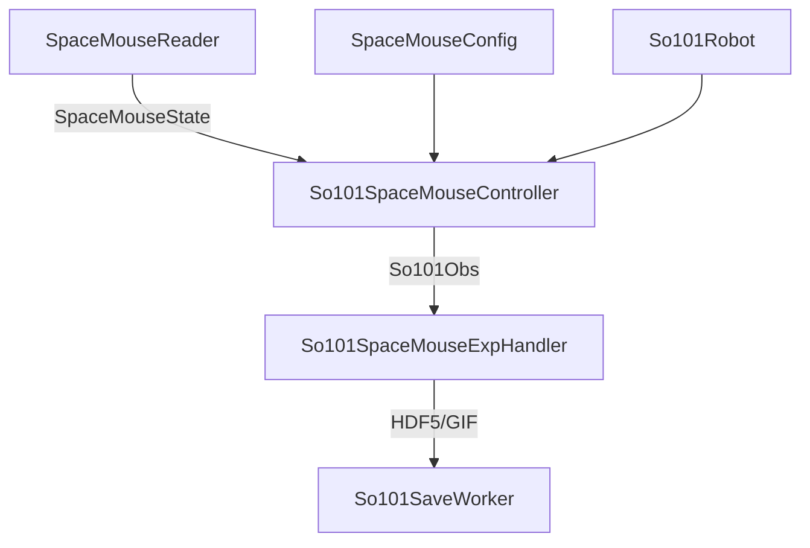

# SpaceMouse API

このページでは、SpaceMouse による SO-101 制御に関連する API を説明します。

## 概要

SpaceMouse 統合は以下のコンポーネントで構成されます:

- **SpaceMouseReader**: `pyspacemouse` のスレッドベースラッパー。デバイスをバックグラウンドでポーリングし、最新の 6-DOF 状態を提供
- **SpaceMouseConfig**: 速度スケーリング、デッドゾーン等の設定
- **So101SpaceMouseController**: SpaceMouse → EE デルタ → IK → Follower の制御パイプライン
- **So101SpaceMouseExpHandler**: データ収集用の対話的ハンドラ



## :material-gamepad-variant: 入力デバイス

### SpaceMouseState {#spacemousestate}

::: robopy.input.spacemouse.SpaceMouseState
    options:
      show_root_heading: true
      show_source: true

### SpaceMouseReader {#spacemousereader}

::: robopy.input.spacemouse.SpaceMouseReader
    options:
      show_root_heading: true
      show_source: true
      members:
        - start
        - stop
        - get_state
        - is_running

## :material-cog: 設定

### SpaceMouseConfig {#spacemouseconfig}

::: robopy.config.input_config.spacemouse_config.SpaceMouseConfig
    options:
      show_root_heading: true
      show_source: true

## :material-robot: コントローラー

### So101SpaceMouseController {#so101spacemousecontroller}

::: robopy.robots.so101.so101_spacemouse.So101SpaceMouseController
    options:
      show_root_heading: true
      show_source: true
      members:
        - __init__
        - connect
        - disconnect
        - teleoperation
        - record_parallel
        - robot
        - is_connected

## :material-flask: 実験ハンドラ

### So101SpaceMouseExpHandler {#so101spacemouseexphandler}

::: robopy.utils.exp_interface.so101_spacemouse_exp_handler.So101SpaceMouseExpHandler
    options:
      show_root_heading: true
      show_source: true
      members:
        - __init__
        - record
        - send
        - record_save
        - close
        - controller

## 使用例

### 基本的なテレオペレーション

```python
from robopy.config.robot_config.so101_config import So101Config
from robopy.robots.so101.so101_robot import So101Robot
from robopy.robots.so101.so101_spacemouse import So101SpaceMouseController

config = So101Config(
    follower_port="/dev/ttyACM0",
    calibration_path="calibration/so101_calib.pkl",
)

robot = So101Robot(cfg=config)
controller = So101SpaceMouseController(robot)
controller.connect()

# 30秒間操作
controller.teleoperation(max_seconds=30)
controller.disconnect()
```

### カスタム設定でのデータ収集

```python
from robopy.config.input_config.spacemouse_config import SpaceMouseConfig

sm_config = SpaceMouseConfig(
    linear_speed=0.05,   # 低速で精密操作
    angular_speed=0.3,
    deadzone=0.08,       # 大きめのデッドゾーン
    control_hz=100,      # 高速な制御ループ
)

controller = So101SpaceMouseController(robot, spacemouse_config=sm_config)
controller.connect()

obs = controller.record_parallel(max_frame=1000, fps=30)
```

### EE デルタの計算式

各制御ステップで、SpaceMouse の軸値から EE デルタを計算します:

$$
\Delta x = \text{axis}_x \times \text{linear\_speed} \times dt
$$

$$
\Delta \text{pitch} = \text{axis}_\text{pitch} \times \text{angular\_speed} \times dt
$$

ここで $dt = 1 / \text{control\_hz}$ です。デッドゾーン内の軸値（$|\text{axis}| < \text{deadzone}$）はゼロとして扱われます。
