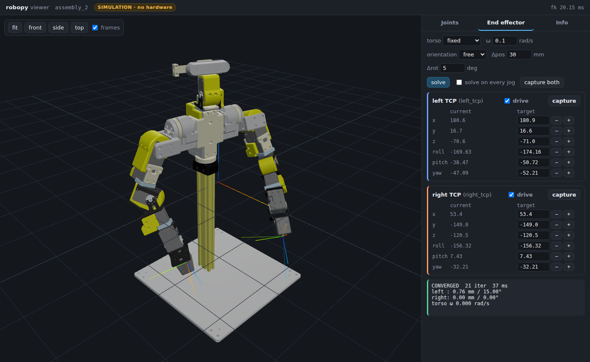

# Rakuda Robot

[`RakudaRobot`](../api/robots.md#robopy.robots.rakuda.rakuda_robot.RakudaRobot)は、二腕ロボットシステムでLeader/Followerアーム構成を持つロボットです。テレオペレーションとデータ収集機能を提供します。

## :material-robot-outline: 構成要素

### ロボットアーム

- **Leader Arm** ([`RakudaLeader`](../api/robots.md#robopy.robots.rakuda.rakuda_leader.RakudaLeader)): 操作者が制御するアーム
- **Follower Arm** ([`RakudaFollower`](../api/robots.md#robopy.robots.rakuda.rakuda_follower.RakudaFollower)): Leaderの動きを追従するアーム
- **Pair System** ([`RakudaPairSys`](../api/robots.md#robopy.robots.rakuda.rakuda_pair_sys.RakudaPairSys)): 両アームの協調制御

### センサー統合

- **カメラ**: Intel RealSenseカメラ対応
- **タクタイルセンサー**: DIGIT触覚センサー対応

## :material-cog: 基本的な使用方法

### 設定の作成

```python
from robopy import RakudaConfig, RakudaSensorParams, TactileParams

config = RakudaConfig(
    leader_port="/dev/ttyUSB0",
    follower_port="/dev/ttyUSB1",
    sensors=RakudaSensorParams(
        cameras=None,
        tactile=[
            TactileParams(serial_num="D20542", name="left"),
            TactileParams(serial_num="D20537", name="right"),
        ],
    ),
    slow_mode=False,  # 高速モード
)
```

### `.robopy/rakuda/config.yaml` による関節トルク設定

Rakudaを使用すると、実行ディレクトリ直下に `.robopy/rakuda/config.yaml` が自動生成されます。
このYAMLで、leader/followerそれぞれ「トルクONにする関節」を関節名で指定できます。

- **read（観測）は常に全関節**
- **write（目標位置送信）はトルクON関節のみ**

例：followerは頭だけトルクON、leaderはgripperだけトルクON

```yaml
leader:
    torque_enabled:
        - l_arm_grip
        - r_arm_grip

follower:
    torque_enabled:
        - torso_yaw
        - head_yaw
        - head_pitch
```

`torque_enabled: null`（またはキー自体を省略）にするとデフォルト挙動になります：

- leader: gripperのみトルクON
- follower: 全関節トルクON

`torque_enabled: []` を指定すると、全関節トルクOFFになります。

`torque_enabled: all` を指定すると、全関節トルクONになります。

利用可能な関節名は、生成された `config.yaml` 内コメント（Available joint names）を参照してください。

### ロボットの操作

```python
from robopy import RakudaRobot

robot = RakudaRobot(config)

try:
    # 接続
    robot.connect()

    # テレオペレーション（10秒間）
    robot.teleoperation(duration=10)

    # データ記録
    obs = robot.record_parallel(max_frame=500, fps=30)

finally:
    robot.disconnect()
```

## :material-database: データ記録機能

### 標準記録

```python
# シーケンシャル記録（低fps推奨）
obs = robot.record(max_frame=100, fps=5)
```

### 並列記録

```python
# 並列記録（高fps対応）
obs = robot.record_parallel(
    max_frame=1000,
    fps=20,
    max_processing_time_ms=25.0
)
```

### 記録データ構造

記録されるデータは[`RakudaObs`](../api/config.md#robopy.config.robot_config.rakuda_config.RakudaObs)型で、以下の構造を持ちます：

```python
{
    "arms": {
        "leader": np.ndarray,    # (frames, 17) - 関節角度など
        "follower": np.ndarray,  # (frames, 17) - 関節角度など
    },
    "sensors": {
        "cameras": {
            "main": np.ndarray,  # (frames, H, W, C) - RGB画像
        },
        "tactile": {
            "left": np.ndarray,  # (frames, H, W, C) - 触覚データ
            "right": np.ndarray, # (frames, H, W, C) - 触覚データ
        }
    }
}
```

## :material-flask: 実験ハンドラー

[`RakudaExpHandler`](../api/utils.md#robopy.utils.exp_interface.rakuda_exp_handler.RakudaExpHandler)を使用すると、より簡単に実験を実行できます：

```python
from robopy.utils.exp_interface import RakudaExpHandler

handler = RakudaExpHandler(
    leader_port="/dev/ttyUSB0",
    follower_port="/dev/ttyUSB1",
    left_digit_serial="D20542",
    right_digit_serial="D20537",
    fps=30
)

# インタラクティブな記録・保存
handler.record_save(
       max_frames=1000,
    save_path="experiment_001",
    if_async=True
)
```

## :material-speedometer: パフォーマンス最適化

### 並列処理

`record_parallel()`メソッドでは、アーム制御とセンサー読み取りを並列化して高速化しています：

```python
# 最大25msの処理時間制限で30Hz記録
obs = robot.record_parallel(
       max_frame=1000,
    fps=30,
    max_processing_time_ms=25.0
)
```

### メモリ効率

- フレームバッファリングなし
- 最新フレームのみ保持
- 効率的な numpy 配列変換

## :material-alert-circle: トラブルシューティング

### 接続エラー

```python
try:
    robot.connect()
except RuntimeError as e:
    print(f"接続失敗: {e}")
    # ポートやボーレート設定を確認
```

### センサー読み取りエラー

```python
# センサーの個別確認
if robot.sensors.tactile:
    for sensor in robot.sensors.tactile:
        if sensor.is_connected:
            print(f"{sensor.name}: 接続OK")
```

### パフォーマンス問題

```python
# フレームスキップ確認
obs = robot.record_parallel(max_frame=100, fps=20)
# ログでスキップされたフレーム数を確認
```

## :material-link-variant: 関連クラス

- [`RakudaConfig`](../api/config.md#robopy.config.robot_config.rakuda_config.RakudaConfig) - ロボット設定
- [`RakudaPairSys`](../api/robots.md#robopy.robots.rakuda.rakuda_pair_sys.RakudaPairSys) - アーム協調制御
- [`RakudaLeader`](../api/robots.md#robopy.robots.rakuda.rakuda_leader.RakudaLeader) - リーダーアーム
- [`RakudaFollower`](../api/robots.md#robopy.robots.rakuda.rakuda_follower.RakudaFollower) - フォロワーアーム

## :material-arm-flex: 制御モード（双腕IK / バイラテラル）

`.robopy/rakuda/config.yaml` に `control:` セクションを書くと、従来の関節位置テレオペに加えて
2つのモードが使えます。**セクションを書かなければ挙動は一切変わりません**（モデルも読み込まず、
電流も一切出力しません）。

| モード | 入力と動作 | IK | 使用する制御モード |
| --- | --- | --- | --- |
| `position_teleop` | 既存どおり、リーダ関節位置をフォロワへ送る | 不要 | 位置制御(3) |
| `cartesian_teleop` | 左右TCP目標からフォロワ関節目標を生成する | 双腕IK | 位置制御(3) |
| `bilateral_joint` | 両側の関節位置・速度から仮想ばね・ダンパのトルクを計算する | 使用しない | 電流制御(0) |

### 実機なしで動かす

どちらのモードも、模擬バス（[`SimulatedDynamixelBus`](../api/robots.md)）で最後まで実行できます。

```bash
# バイラテラル（模擬。接触反力の例は --contact）
uv run python examples/robot/rakuda_bilateral.py --contact

# 双腕IK（kinematics extra が必要）
uv sync --extra kinematics
uv run --extra kinematics python examples/robot/rakuda_cartesian_teleop.py --collision
```

### 起動

```python
from robopy.robots.rakuda import RakudaPairSys

pair = RakudaPairSys(config)
pair.connect()

system = pair.start_control()      # configure → align → start
...
pair.stop_control()                # 停止方針を適用してバスを返す
```

`start_control()` 実行中は両バスの指令権を制御システムが保持し、
`control_step()` / `send_follower_action()` などの旧経路は明示的に拒否されます
（1ポート1書き手）。観測API (`get_observation()`) は配列の形・順序・単位（degree）を
変えずに、サーボのキャッシュを読みます。SI単位の詳細状態は `pair.detailed_state()` で取れます。

## :material-cube-scan: 3Dビューア／シミュレータ（実機不要）



UFactory Studio の「モデルだけを動かして確認する」に相当するブラウザUIです。
関節角度（スライダ／数値／±ジョグ）またはエンドエフェクタ姿勢（xyz・roll/pitch/yaw のスライダ／数値／±ジョグ）で
モデルを動かし、3D表示で確認できます。3D表示上のTCPの球を**直接ドラッグ**（クリック、またはタップ＆ホールド）しても動かせます。
**ページ上の何もモータへは送られません。**

```bash
uv sync --extra kinematics

# 引数なし: リポジトリ同梱の実モデル（models/rakuda）で起動。
#   `git lfs pull` 済みなら視覚メッシュ、未取得なら凸包（<collision>）描画に自動フォールバック
uv run robopy-viewer
uv run robopy-viewer --geometry collision   # 凸包を明示的に描く

# 合成モデル（Rakudaのトポロジ、幾何は架空）
uv run robopy-viewer --synthetic

# 別の場所にあるURDFを指定
uv run robopy-viewer --urdf <path>/assembly_2.urdf --package-dir <models> \
    --soft-limit torso_yaw_dof=-1.57,1.57

# .robopy/rakuda/config.yaml の control.model（URDF・ソフト制限・TCP・関節グループ）を使う
uv run robopy-viewer --config
```

**関節範囲は実機 leader-follower と同じ「モータの可動範囲」に揃えてあります**: スライダは
0〜4095カウント（ゼロ点2048）に対応する **±180°**、初期値は 0°（＝ゼロカウント）です。
CADエクスポート（URDF）が宣言する範囲ではありません — URDF側は `shoulder_roll_left_dof` が
−22.5°〜197.5°、`elbow_yaw_left_dof` が −139.1°〜220.9° のように非対称で、実機で動かせる範囲と一致しません。
ただしこれは**サーボが許す範囲**であって可動域の実測ではありません。実際に止まる位置は計測値なので、
`.robopy/rakuda/config.yaml`（`--config`）か `--soft-limit` でソフト制限として与えてください（与えればスライダも狭まります）。
ソルバ（IK）は従来どおりURDFの範囲＋ソフト制限を守ります。その範囲外へスライダで動かしてから solve すると、
実機と同じく「limits を既に逸脱している」と言って動きません。

`http://127.0.0.1:8765` を開きます（`--port`, `--host`, `--no-browser`, `--no-ik` あり）。

| タブ | 内容 |
| --- | --- |
| Joints | 胴体／左腕／右腕／頭部ごとのスライダ・数値入力・±ジョグ（deg/rad切替、ステップ幅）。範囲はモータ可動範囲 ±180°（初期値0°）、ツールチップに出典とソルバ側の範囲を表示。`zero all`、`copy JSON`（rad） |
| End effector | 左右TCPの現在姿勢（mm / deg）と目標。3Dビュー上の球を直接ドラッグ、各成分のスライダ（ドラッグ中も逐次IK）・数値入力・±ジョグ、`capture`、左右の `track TCP`、非操作腕の follow torso / hold TCP in world、胴体方針 fixed/manual/optimize、姿勢モード soft/keep/free、`solve`／ジョグごとに自動solve |
| Info | URDFパス、nq/nv、IKの関節グループ（名前から推定した場合もここに明示）、モデル監査の警告 |

片腕操作では、反対側の `track TCP` を外してください。既定の `follow torso (keep joints)`
では非操作腕の6関節にIKによる運動を指令せず、TCPのワールド座標は共有胴体と一緒に変化します。
胴体をIKに選ばせるには `torso: optimize` を選びます。両方の `track TCP` が有効なら、
両手の目標を追跡します。再度有効にした腕の目標は、その時点のTCP姿勢で取り直します。

Python APIも同じ既定動作です。例えば右腕のみなら
`DualArmTarget(left_enabled=False, right_target=T_right, torso_policy=TorsoPolicy.OPTIMIZE)`
とします。従来の非操作TCPのワールド座標保持が必要な場合だけ、
`inactive_arm_policy=InactiveArmPolicy.HOLD_WORLD` を指定してください。
`InactiveArmPolicy` は `robopy.control` からインポートできます。
非操作腕の衝突形状・関節範囲のチェックは残ります。この設定はモータのトルクOFFを意味しません。

設計上のポイント:

- **運動学は全てサーバ側**（`WholeBodyModel` / `DualArmIK`）。ページはFK/IKの結果を描くだけなので、
  表示と制御スタックの解が食い違いません。Pinocchio/Pinkが必要（`kinematics` extra）。
- 3D描画は three.js を**同梱**（`src/robopy/viewer/static/vendor/`、MIT）。オフラインの実験室でも動きます。
- **関節範囲の出典**: `/api/model` は各関節について、スライダ範囲（`lower`/`upper`）とその出典（`limit_source`:
  `motor` / `soft` / `urdf` / `display`）、そしてソルバが守る範囲（`model_lower`/`model_upper`）を別々に返します。
  「実機で動かせる範囲」と「モデルが認める範囲」を混ぜないための区別です。`--synthetic` の合成モデルには
  モータが無いので、従来どおりURDFの範囲を使います。
- **接地面**: グリッドは床です。関節で動かないジオメトリ（＝土台）の最下面に置きます。モデル原点ではありません —
  Rakudaのエクスポートでは原点は土台の底から約 26 cm 上にあり、原点に描いていたグリッドは胴体を突き抜けていました。
  土台を描かないモデルでは従来どおり root フレーム（z = 0）に置きます。
- **手先の直接ドラッグ**: 各TCPに置いた球が目標そのものです。掴むとカメラに正対する平面上を追従し（残り1軸は視点を回すか、
  Shiftを押しながら掴んで鉛直移動）、ドラッグ中は逐次IK、離した時点でフル反復でもう一度解きます。姿勢（roll/pitch/yaw）は
  変更せず位置のみ動かします。ポインタイベントで実装しているのでタップ＆ホールドでも同じで、球以外を掴んだときは
  従来どおりカメラが回ります（OrbitControls より先に capture フェーズで判定しているため、掴んだ瞬間に視点が回ることはありません）。
- **目標値のスライダ**: xyz の範囲は「肩から腕を伸ばしきった長さ」（サーバが `ik.workspace` として返す上界）で、
  到達可能性の主張ではありません。ドラッグ中は反復150回・トゥイーンなしで解き、離した時点でフル反復でもう一度解きます。
  リクエストはFKと同じく合流（coalesce）するので、速くドラッグしても古い解が溜まりません。
- 実モデルの視覚メッシュ（53 MB / 137個）があればサーバから配信し、初回ロードに数秒かかります。なければ凸包（2.9 MB）を描画します。
- メッシュは非同期にダウンロードされ、FK の応答より後に届いたものにも最新の姿勢が適用されます（以前は遅く届いたパーツが原点に置かれたままになり、回線が遅いとロボットがバラバラに見えました）。ブラウザ実機の回帰テストは
  `uv run --extra kinematics --with playwright pytest tests/test_rakuda_control/test_viewer_browser.py`（Playwright は任意依存）。
- TCPは `gripper_*_dof` からのオフセット**ゼロ**で置かれ、Infoタブにその旨の警告が出ます（実測が必要）。
- continuous関節にソフト制限を与えない場合、スライダ範囲は表示用の ±π、IKは「幾何学的検討のみ」と表示。
- **姿勢モード（orientation）**: Rakudaの手首は2軸（yaw・pitch）で球面手首ではないため、
  「姿勢を完全に保ったまま平行移動」は6自由度あっても一般に到達不能です（実モデルで確認:
  垂れた腕から +30 mm の平行移動は大域探索でも最良 7.4 mm 残る）。この場合ソルバは重み付きの妥協点で
  止まり、APIは `stalled: true` を返し、ページは「これ以上変わらない」と明示します。
  `free`（姿勢重み0）にすると位置だけを追うので、xArmのCartesianジョグに相当する使い方ができます。
  `soft`（0.15、既定）は位置優先、`keep`（1.0）は両方同等です。
- **初期姿勢の注意**: 全関節0の姿勢では腕が伸びきって垂れており、手先は最大到達距離の約96%（実モデルで計測）
  にあります。高さを保った平行移動の多くは作業空間の外なので、Joints タブで肘を曲げてから
  Cartesian ジョグしてください（UFactory Studio の home 姿勢に相当）。肘は片方向にしか曲がりません —
  この URDF では `elbow_pitch_left_dof` は正（0〜+2.31 rad）、`elbow_pitch_right_dof` は負（−2.79〜0 rad）。
  例えば左 +0.8 / 右 −0.8 rad に曲げた姿勢からは、実モデルで ±x/±y/±z の 30 mm ジョグが
  soft/free とも 9〜34 反復・1 mm 未満で収束します（計測済み）。到達できない場合、ページは
  「限界に座っている関節」か「作業空間の外」かを区別して説明します。
- `/api/fk`, `/api/ik`, `/api/model` はJSONのSI単位APIです。DORA等の外部ノードから叩くこともできます。

実機の状態をこのページに**ミラー表示**する機能は未実装です（サーボループのスナップショットを
`/api/fk` 相当の入力にすれば実現できますが、初回では対象外）。

## :material-ruler: 単位と校正

### 電流定数の表記

`RAKUDA_CONTROLTABLE_VALUES` の電流値（`FOLLOWER_GRIP_GOAL_CURRENT = 128` など）は
**raw制御テーブル値**です。以前のコメントは "mA" と書かれていましたが、コードは一貫して
rawを送っていました。**挙動は維持**してあり、128 は今も raw 128（フォロワXM430で約0.34 A）です。
アンペアが必要な場合は `RAKUDA_CONTROLTABLE_VALUES.raw_current_to_a(128, "xm430-w350")` を使います。

| 型番 | 電流1 count | 電流測定位置 |
| --- | --- | --- |
| XM430-W350 | 0.00269 A | モータ巻線 |
| XM540-W270 | 0.00269 A | モータ巻線 |
| XC330-T288 | 0.001 A | 電源入力側（XMと同じトルク観測モデルは流用不可） |

### 変換境界

raw値とSI単位の変換は [`robopy.control.joint_mapping`](../api/robots.md) の1箇所だけで行います。

- 位置: `q = direction * (count - zero_count) * 2*pi/4096`
- 速度: `v = direction * raw * 0.229 * 2*pi/60`（位置オフセットは加えない）
- 電流: `i = direction * raw * (型番ごとの単位)`

multi-turn位置は `[-pi, pi]` へ折り返しません。`zero_count` は
**モータ内の Drive Mode / Homing Offset 適用後の `PRESENT_POSITION` 読出し値**に対して定義し、
その2つのレジスタ値も校正と一緒に記録します。

## :material-alert: 実機で必要な未確定値

以下は**測定値であり、推測で埋めてはいけません**。未測定の項目は `null` のままにしてください。
`JointMap.require()` が不足項目を列挙して停止します。

| 項目 | 影響 |
| --- | --- |
| モータ名 ↔ URDF関節名の対応 | 名前から推定しない（`*_sh_pitch2`, `*_el_yaw`, `*_wr_roll` 等） |
| `zero_count` / `direction` / 可動範囲 | 位置指令すべて |
| `torque_constant_nm_per_a` / `current_limit_a` | 電流出力（バイラテラル） |
| TCP（`gripper_*_dof` からのオフセット） | Cartesian精度 |
| continuous関節の実可動域（胴体yaw・両肩pitch） | URDFに範囲がない。ソフト制限必須 |
| 重力補償モデル（リーダ・フォロワ別） | 電流制御時の自重落下 |

`control.allow_hardware_current_output` は既定で `false` です。上記が測定され
`validated: true` になるまで、バイラテラルモードは `configure()` で拒否されます。

### モデルの配置（`models/rakuda/`）

実モデル `Rakuda-2_simulation_ready.zip` はアーカイブ内のレイアウトのまま `models/rakuda/assembly_2/` に
コミットしてあります（`package://assembly_2/...` は `--package-dir models/rakuda` で解決）。
Python パッケージの外（リポジトリ直下）に置いてあるので wheel は肥大化しません。

| 内容 | 管理 | 用途 |
| --- | --- | --- |
| `urdf/*.urdf`（3種）、`collision_meshes/`（凸包137個、2.9 MB） | 通常の git | 運動学・IK・衝突判定・凸包表示。**clone だけで動く** |
| `meshes/`（視覚メッシュ137個、53 MB） | **Git LFS**（`.gitattributes` で設定済み） | ビューアの見た目のみ |

**視覚メッシュはまだリポジトリに入っていません。** この実装を行った環境からは GitHub の LFS
サーバ（`lfs.github.com`）への接続が egress ポリシーで拒否されるため、LFS オブジェクトを
アップロードできませんでした。追加は一度だけ、LFS を使える手元のマシンで行います（`.gitattributes`
の規則があるので `git add` 時に自動で LFS ポインタになります。詳細は `models/rakuda/README.md`）:

```bash
git lfs install
unzip -j Rakuda-2_simulation_ready.zip 'assembly_2/meshes/*.stl' -d models/rakuda/assembly_2/meshes/
git add models/rakuda/assembly_2/meshes
git lfs ls-files | wc -l        # 137 と出れば LFS 管理になっている
git commit -m "models(rakuda): add visual meshes via Git LFS" && git push
```

追加後のクローンでは次で取得します（任意。なくても凸包で表示できます）:

```bash
git lfs install && git lfs pull
```

`robopy.models.find_rakuda_model()` は視覚メッシュの状態を `visual_mesh_status` で
`PRESENT`（実体あり）/ `LFS_POINTERS`（`git lfs pull` 前）/ `ABSENT`（未追加）と区別します。
どちらの不在でもビューアは同じ URDF の `<collision>`（通常 git の凸包）を描画し、Info タブと起動ログに
理由と対処が出ます（`--geometry visual|collision|auto` で明示もできます）。
注意: `assembly_2_convex_collision.urdf` は `<visual>` に元の視覚メッシュ、`<collision>` に凸包を
持つので、「凸包 URDF を読めば凸包が表示される」わけではありません。
コードからは次のように参照します。

```python
from robopy.models import find_rakuda_model

m = find_rakuda_model()            # None なら models/ が見つからない（wheel インストール等）
m.convex_collision_urdf, m.visual_urdf, m.package_dir, m.visual_mesh_status
m.visual_mesh_hint()               # 不在時の対処を 1 行で返す（PRESENT なら None）
```

探索順は環境変数 `ROBOPY_MODELS_DIR` → 引数 → パッケージ位置／カレントディレクトリから上位に `models/` を探す、
です。wheel でインストールした環境では `ROBOPY_MODELS_DIR` でチェックアウトの `models/` を指してください。

### 実モデル（`Rakuda-2_simulation_ready.zip`）の監査結果

`assembly_2/urdf/assembly_2_convex_collision.urdf` を `python -m robopy.kinematics.urdf_audit` で
監査した結果です（生データ: `docs/robots/assets/rakuda_urdf_audit.json`）。

| 項目 | 結果 |
| --- | --- |
| ルートリンク | `root` |
| リンク／関節 | 153 / 152（fixed=137, revolute=12, continuous=3） |
| 可動自由度 | 15 = 胴体1 + 左腕6 + 右腕6 + 頭部2 |
| メッシュ | 274参照。`--package-dir <展開先>` で全て解決（視覚メッシュ未追加のチェックアウトでは `meshes/` の137参照が未解決になる） |
| 総質量 | **0.0020693 kg → 幾何専用。動力学モデルとして採用不可** |
| `effort` / `velocity` | revolute 12関節すべて `1 / 1` のプレースホルダ |
| continuous関節 | `torso_yaw_dof`, `shoulder_pitch_left_dof`, `shoulder_pitch_right_dof`（範囲なし） |
| 同名の関節とリンク | `gripper_left_dof`, `gripper_right_dof`, `head_camera_link` |
| ゼロ姿勢が可動限界上 | `elbow_pitch_right_dof` の範囲は `(-2.7925, 0.0000)`。**全関節0はこの関節の上限そのもの** |

構造の確認（Jacobianから）: `torso_yaw_dof` は両手に効き、各腕の6関節は自分の手だけに効き、
頭部2関節はどちらの手にも効きません。双腕IKの前提と一致します。

実モデルで確認できたこと（合成モデルではなく本体）:

- 双腕IKが FK生成の到達可能目標へ収束: **位置 0.80 / 0.85 mm、姿勢 < 0.01 rad、1回 0.7〜0.9 ms**、
  `fixed` / `manual` / `optimize` の3方針すべて。頭部への指令なし。
- `examples/robot/rakuda_cartesian_teleop.py --urdf <実URDF>` がそのまま動作（0.06 / 0.10 mm）。

実モデルで見つかり修正した不具合:

- 上記の同名フレーム: Pinocchio が `FIXED_JOINT` と `BODY` の2フレームを同名で持ち、名前解決が例外を出す。
  `WholeBodyModel.frame_id()` が両者の一致を確認して解決するようにし、TCPは必ず一意名の追加フレームで
  定義する（監査でも警告）。
- 可動限界上のゼロ姿勢: 限界に向かう関節で**加速度制限と位置制限が矛盾し「減速して止まる」解が消える**
  不具合。加速度窓を位置窓へクリップする形に修正（安全側の制限が常に優先）。

**衝突判定の計算コスト（実測）**: 凸包274個の全ペア（7472組）で距離計算に **約2.3秒**。
腕同士＋腕と胴体に絞った1494組でも **約0.4秒**、経路検証を含むIK 1回で **約1.2秒**。
このCAD出力の粒度（部品ごとの凸包）は制御周期には乗りません。選択肢は
(a) リンクごとに数個のプリミティブへ縮約した衝突モデルを別途用意する（モデリング作業）、
(b) 衝突判定を低周期の事後検証に限定する、のどちらかで、ソフトウェア側で誤魔化せる量ではありません。
中立姿勢で20 mm以内のペアは、ベアリング・ワッシャ・カバー等の恒久的な機構的近接（全ペアで36組）です。
`WholeBodyModel.pairs_closer_than()` で列挙し、理由つきで除外に記録してください。

設定の雛形: `examples/config/rakuda_control.example.yaml`（`urdf_path` は同梱モデルを指し、未測定値はすべて `null`）。

### モデルの監査

URDFは使う前に監査します（kinematics extra は不要）。

```bash
python -m robopy.kinematics.urdf_audit path/to/robot.urdf --package-dir path/to/pkgs
```

総質量が非現実的（CAD出力では数mgになることがあります）、`effort=1 velocity=1` の
プレースホルダ、`*_dof` という名前の固定関節、範囲のないcontinuous関節などを警告します。
**質量を書き換えて「動力学検証済み」にしないでください。** 幾何専用モデルとして扱います。

## :material-stop-circle: 停止方針と異常時

`control.stop_policy` は機構と支持条件に応じて選びます。万能な既定値はありません。

| 方針 | 内容 | 前提 |
| --- | --- | --- |
| `zero_current` | 電流ゼロ、トルクはON | バックドライバブルで支持されている、または水平 |
| `torque_off` | トルクOFF | 落下するものがない |
| `hold_position` | 測定姿勢で位置制御に切替えて保持 | その姿勢を自力で保持できる |

- 片側の読取り／書込み失敗、状態の古さ、周期超過、温度・電圧異常、範囲超過、不正数値で
  両側を `FAULT` にします。`FAULT` からの復帰は `CONFIGURING` 経由のみで、再検証が必須です。
- 通信不能側には書き込めません。その場合はモータ側の `BUS_WATCHDOG`
  （`control.bus_watchdog_counts`、20 ms/count）に委ねます。
- Bus Watchdog は**全Instruction Packet**が対象なので、読取りを続けている限り
  Goal更新を止めただけでは発火しないことがあります。読取りだけ生きている状況も別途検出します。

## :material-chart-line: 周期の報告

設定周期と実測周期は別に表示されます。

```python
report = system.report()
report["timing"]["configured_rate_hz"]        # 設定値
report["timing"]["measured_period_s"]         # p50/p95/p99/max、期限超過数
report["timing"]["servos"]["follower"]["read"]
```

数百Hzでの動作は、この実測値が出るまで保証されません。
