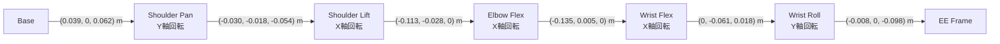
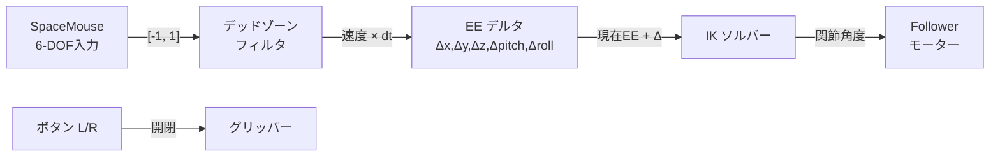

# SO-101 Robot

[`So101Robot`](../api/robots.md#robopy.robots.so101.so101_robot.So101Robot)は、Feetech STS3215サーボモーターを使用した6軸二腕ロボットシステムです。

## :material-robot-outline: 構成要素

### ロボットアーム

- **Leader Arm**: 操作者が制御するアーム（テレオペレーション用）
- **Follower Arm**: Leaderの動きを追従するアーム

各アームは6つの関節で構成されています:

| 関節名 | 機能 |
|--------|------|
| `shoulder_pan` | 肩の水平回転 |
| `shoulder_lift` | 肩の上下回転 |
| `elbow_flex` | 肘の屈伸 |
| `wrist_flex` | 手首の屈伸 |
| `wrist_roll` | 手首の回転 |
| `gripper` | グリッパーの開閉 |

### センサー統合

- **カメラ**: Webカメラ または Intel RealSenseカメラ対応

## :material-cog: 基本的な使用方法

### 設定の作成

```python
from robopy.config.robot_config.so101_config import So101Config

# 基本設定（Followerのみ、Leaderなし）
config = So101Config(
    follower_port="/dev/ttyACM0",
    calibration_path="calibration/so101_calib.json",
)

# Leader付き設定（テレオペレーション用）
config = So101Config(
    leader_port="/dev/ttyACM0",
    follower_port="/dev/ttyACM1",
    calibration_path="calibration/so101_calib.json",
)
```

### カメラ付きの設定

```python
from robopy.config.robot_config.so101_config import So101Config, So101SensorConfig
from robopy.config.sensor_config.visual_config.camera_config import WebCameraConfig

config = So101Config(
    follower_port="/dev/ttyACM0",
    calibration_path="calibration/so101_calib.json",
    sensors=So101SensorConfig(
        cameras={
            "top": WebCameraConfig(fps=30, width=640, height=480),
        }
    ),
)
```

## :material-tune: キャリブレーション

`robot.connect()` 時にキャリブレーションファイルが存在しない場合、対話的なキャリブレーションが自動実行されます。キャリブレーション方式は [lerobot](https://github.com/huggingface/lerobot) の最新版と同一です。

### キャリブレーション手順

キャリブレーションは各アーム（Leader / Follower）ごとに2ステップで行います。

**ステップ 1: 可動域の中央位置を設定**

各関節を可動域のおよそ中央に移動し、Enter を押します。各モーターのホーミングオフセット（`homing_offset = 現在位置 - 2047`）が計算され、モーターの EEPROM に書き込まれます。

**ステップ 2: 可動域の記録**

`wrist_roll` 以外の各関節を端から端までゆっくり動かし、Enter を押します。各関節の最小値（`range_min`）・最大値（`range_max`）がリアルタイムで記録されます。`wrist_roll` は全回転関節として `[0, 4095]` が自動設定されます。

### キャリブレーションファイル

キャリブレーションデータは JSON 形式で保存されます。

```json
{
    "leader": {
        "shoulder_pan": {
            "id": 1,
            "drive_mode": 0,
            "homing_offset": -150,
            "range_min": 1024,
            "range_max": 3072
        },
        "gripper": {
            "id": 6,
            "drive_mode": 0,
            "homing_offset": -80,
            "range_min": 1500,
            "range_max": 2600
        }
    },
    "follower": { ... }
}
```

| フィールド | 説明 |
|-----------|------|
| `id` | モーター ID（1〜6） |
| `drive_mode` | 駆動方向（0 = 通常） |
| `homing_offset` | ホーミングオフセット（中央位置の補正値） |
| `range_min` | 可動域の最小エンコーダ値 |
| `range_max` | 可動域の最大エンコーダ値 |

### 位置の正規化

キャリブレーションデータに基づき、生のエンコーダ値がユーザー向けの値に変換されます。

- **DEGREES モード**（shoulder_pan, shoulder_lift, elbow_flex, wrist_flex, wrist_roll）:
    - `(raw - mid) * 360 / 4095`（`mid = (range_min + range_max) / 2`）
- **RANGE_0_100 モード**（gripper）:
    - `[range_min, range_max]` → `[0, 100]` への線形マッピング

!!! tip "再キャリブレーション"
    キャリブレーションをやり直すには、`calibration_path` で指定した JSON ファイルを削除してから `robot.connect()` を呼び出してください。

### ロボットの操作

```python
from robopy.robots.so101.so101_robot import So101Robot

robot = So101Robot(config)

try:
    # 接続（初回はキャリブレーションが自動実行されます）
    robot.connect()

    # テレオペレーション（10秒間）
    robot.teleoperation(max_seconds=10)

finally:
    robot.disconnect()
```

## :material-database: データ記録

```python
# 基本的なデータ記録
obs = robot.record(max_frame=100, fps=5)

# 記録されたデータの確認
print(f"Leader アーム: {obs.arms.leader.shape}")     # (frames, 6)
print(f"Follower アーム: {obs.arms.follower.shape}")  # (frames, 6)
```

### 高速並列記録

```python
# テレオペレーションとカメラ取得を並列実行
obs = robot.record_parallel(
    max_frame=500,
    fps=20,
    teleop_hz=25,
)
```

## :material-play: アクションの送信

### 関節空間でのアクション送信

記録した関節角度の軌道をそのまま再生できます。

```python
import numpy as np

# leader_action: (frames, 6) の関節角度配列（度数）
robot.send(
    max_frame=100,
    fps=20,
    leader_action=recorded_joint_trajectory,
    teleop_hz=100,
)

# 1フレームだけ送信
robot.send_frame_action(np.array([0.0, 30.0, -45.0, 20.0, 0.0, 50.0]))
```

### エンドエフェクタ空間でのアクション送信

Inverse Kinematics (IK) を使用して、エンドエフェクタの姿勢を指定してロボットを制御できます。詳細は[キネマティクス](#kinematics)セクションを参照してください。

```python
import numpy as np

# エンドエフェクタ姿勢: [x, y, z, pitch, roll, gripper_deg]
ee_action = np.array([0.1, 0.0, 0.15, 0.0, 0.0, 50.0], dtype=np.float32)
robot.send_ee_frame_action(ee_action)

# 軌道として送信
ee_trajectory = np.zeros((50, 6), dtype=np.float32)
# ... 軌道を設定 ...
robot.send_ee(max_frame=50, fps=20, ee_actions=ee_trajectory)
```

## :material-axis-arrow: キネマティクス {#kinematics}

SO-101は5自由度（gripper除く）のシリアルリンクアームです。`So101Robot`にはForward Kinematics (FK) と Inverse Kinematics (IK) が組み込まれています。

### Forward Kinematics (FK)

関節角度からエンドエフェクタの姿勢を計算します。`@classmethod`なのでハードウェア接続なしで使用可能です。

```python
import numpy as np
from robopy.robots.so101.so101_robot import So101Robot

# 関節角度（度数）→ エンドエフェクタ姿勢
joint_angles = np.array([0.0, 30.0, -45.0, 20.0, 0.0, 50.0], dtype=np.float32)
ee_pose = So101Robot.forward_kinematics(joint_angles)

print(f"位置: x={ee_pose.x:.4f} m, y={ee_pose.y:.4f} m, z={ee_pose.z:.4f} m")
print(f"姿勢: pitch={np.rad2deg(ee_pose.pitch):.1f}°, roll={np.rad2deg(ee_pose.roll):.1f}°")
```

!!! info "入力形式"
    - (5,) 配列: 5関節の角度（gripper なし）
    - (6,) 配列: 6関節の角度（最後の gripper は無視される）

### Inverse Kinematics (IK)

目標のエンドエフェクタ姿勢から関節角度を求めます。Damped Least-Squares アルゴリズムを使用しています。

```python
from robopy.kinematics import EEPose, IKConfig

# 方法1: EEPoseオブジェクトで指定
target = EEPose(x=0.1, y=0.0, z=0.15, pitch=0.0, roll=0.0)
current_joints = np.array([0.0, 0.0, 0.0, 0.0, 0.0, 0.0], dtype=np.float32)

result = robot.inverse_kinematics(target, current_joints)
print(f"収束: {result.success}")
print(f"関節角度 (rad): {result.joint_angles_rad}")
print(f"位置誤差: {result.position_error:.6f} m")

# 方法2: numpy配列で指定
target_array = np.array([0.1, 0.0, 0.15, 0.0, 0.0], dtype=np.float32)
result = robot.inverse_kinematics(target_array, current_joints)
```

### IKパラメータの調整

IKソルバーの挙動はカスタマイズできます。

```python
from robopy.kinematics import IKConfig

config = IKConfig(
    max_iterations=200,           # 最大反復回数
    position_tolerance=1e-4,      # 位置収束閾値 (m)
    orientation_tolerance=1e-3,   # 姿勢収束閾値 (rad)
    damping=0.05,                 # ダンピング係数（大きいほど安定）
    position_weight=1.0,          # 位置の重み
    orientation_weight=0.1,       # 姿勢の重み
)

result = robot.inverse_kinematics(target, current_joints, ik_config=config)
```

!!! tip "位置優先 vs 姿勢優先"
    `position_weight` と `orientation_weight` の比率を変えることで、位置精度と姿勢精度のバランスを調整できます。デフォルト設定では位置精度を優先しています。

### キネマティックチェーンの直接利用

ハードウェア接続なしでFK/IKの計算のみ行いたい場合:

```python
from robopy.kinematics import so101_chain, IKSolver
import numpy as np

# チェーンとソルバーを作成
chain = so101_chain()
solver = IKSolver(chain)

# FK: 関節角度（ラジアン）→ 姿勢
q = np.zeros(5)
pose = chain.forward_kinematics(q)
print(f"Home位置: {pose[:3]}")

# IK: 姿勢 → 関節角度
result = solver.solve(target_pose=pose, initial_angles_rad=q)

# 4x4同次変換行列も取得可能
T = chain.forward_kinematics_matrix(q)
```

### SO-101 のキネマティックパラメータ

SO-101の物理パラメータは[SO-ARM100のURDF](https://github.com/TheRobotStudio/SO-ARM100)から取得しています。



| 関節 | オフセット (m) | 回転軸 | 可動範囲 |
|------|---------------|--------|---------|
| shoulder_pan | (0.039, 0, 0.062) | Y | -110° ~ +110° |
| shoulder_lift | (-0.030, -0.018, -0.054) | X | -100° ~ +100° |
| elbow_flex | (-0.113, -0.028, 0) | X | -96.8° ~ +96.8° |
| wrist_flex | (-0.135, 0.005, 0) | X | -95° ~ +95° |
| wrist_roll | (0, -0.061, 0.018) | Y | -157.2° ~ +162.8° |

!!! note "5自由度の制約"
    SO-101はgripperを除くと5自由度です。エンドエフェクタの位置（x, y, z）と姿勢のうち2成分（pitch, roll）を制御できますが、yaw（ヨー）は独立に制御できません。

## :material-gamepad-variant: SpaceMouse による制御 {#spacemouse}

3Dconnexion SpaceMouse を使用して、エンドエフェクタ空間でSO-101を直感的に制御できます。Leaderアームの代わりにSpaceMouseをテレオペレーションの入力デバイスとして使用し、データ収集も可能です。

### 動作原理

SpaceMouseの6軸入力（x, y, z, roll, pitch, yaw）は**エンドエフェクタ姿勢の変化量（デルタ）**として扱われます。各制御ステップで:

1. SpaceMouseの軸値（[-1, 1]に正規化）を読み取る
2. デッドゾーンを適用（微小な入力をフィルタ）
3. 速度スケーリングとdtを掛けてEEデルタを計算
4. 現在のEE目標姿勢にデルタを加算
5. IKで関節角度に変換し、Followerに送信



!!! info "EEデルタ方式"
    SpaceMouseの入力は**絶対姿勢ではなく、姿勢の変化量**として扱います。これにより:

    - 操作開始時のロボット姿勢に関係なく直感的に操作できる
    - 小さな入力で微細な動きを実現できる
    - 入力がゼロのとき、ロボットは静止する

### インストール

SpaceMouse サポートはオプション依存です:

```bash
# uv を使用
uv sync --group spacemouse

# pip を使用
pip install pyspacemouse
```

!!! warning "Linuxでの権限設定"
    Linux環境ではSpaceMouseデバイスへのアクセスに udev ルールの設定が必要な場合があります。`pyspacemouse` の[セットアップガイド](https://github.com/JakubAndrworksysek/PySpaceMouse)を参照してください。

### 基本的なテレオペレーション

```python
from robopy.config.robot_config.so101_config import So101Config
from robopy.robots.so101.so101_robot import So101Robot
from robopy.robots.so101.so101_spacemouse import So101SpaceMouseController

# Followerのみの設定（Leaderアーム不要）
config = So101Config(
    follower_port="/dev/ttyACM0",
    calibration_path="calibration/so101_calib.json",
)

robot = So101Robot(cfg=config)
controller = So101SpaceMouseController(robot)

try:
    # ロボット接続 + SpaceMouse起動
    controller.connect()

    # SpaceMouseで30秒間テレオペレーション
    controller.teleoperation(max_seconds=30)

    # 時間制限なし（Ctrl+C で停止）
    # controller.teleoperation()

finally:
    controller.disconnect()
```

### 速度・感度の調整

`SpaceMouseConfig` で操作感をカスタマイズできます。

```python
from robopy.config.input_config.spacemouse_config import SpaceMouseConfig

config = SpaceMouseConfig(
    linear_speed=0.10,     # 並進速度: SpaceMouse 1.0 → 0.10 m/s
    angular_speed=0.5,     # 回転速度: SpaceMouse 1.0 → 0.5 rad/s
    gripper_speed=50.0,    # グリッパー速度: 50 deg/s per button
    deadzone=0.05,         # デッドゾーン: |axis| < 0.05 → 0
    control_hz=50,         # 制御ループ周波数
)

controller = So101SpaceMouseController(robot, spacemouse_config=config)
```

| パラメータ | デフォルト | 説明 |
|-----------|-----------|------|
| `linear_speed` | 0.10 m/s | 並進方向の最大速度 |
| `angular_speed` | 0.5 rad/s | 回転方向の最大速度 |
| `gripper_speed` | 50.0 deg/s | グリッパー開閉速度 |
| `deadzone` | 0.05 | 入力のデッドゾーン閾値 |
| `control_hz` | 50 Hz | 制御ループの周波数 |

!!! tip "操作のコツ"
    - `linear_speed` を小さくすると精密な位置決めが楽になります
    - `deadzone` を大きくすると不意な動きを防げます
    - グリッパーは**左ボタンで閉じ**、**右ボタンで開き**ます

### グリッパー操作

SpaceMouseのボタンでグリッパーを制御します:

| ボタン | 動作 |
|--------|------|
| 左ボタン | グリッパーを閉じる（角度減少） |
| 右ボタン | グリッパーを開く（角度増加） |

グリッパー角度は 0° ～ 100° にクランプされます。

### データ収集（記録）

SpaceMouseでロボットを操作しながら、関節角度とカメラ画像を記録できます。記録されたデータは既存の再生パイプライン（`So101Robot.send()`）と互換性があります。

```python
from robopy.config.sensor_config.visual_config.camera_config import WebCameraConfig
from robopy.config.robot_config.so101_config import So101Config, So101SensorConfig

# カメラ付き設定
config = So101Config(
    follower_port="/dev/ttyACM0",
    calibration_path="calibration/so101_calib.json",
    sensors=So101SensorConfig(
        cameras={
            "top": WebCameraConfig(fps=30, width=640, height=480),
        }
    ),
)

robot = So101Robot(cfg=config)
controller = So101SpaceMouseController(robot)
controller.connect()

# SpaceMouse操作を記録
obs = controller.record_parallel(
    max_frame=500,       # 記録フレーム数
    fps=20,              # カメラキャプチャレート
    control_hz=50,       # SpaceMouse制御レート（fpsより高くする）
)

print(f"Leader (指令値): {obs.arms.leader.shape}")    # (500, 6)
print(f"Follower (実測値): {obs.arms.follower.shape}")  # (500, 6)
for name, frames in obs.cameras.items():
    if frames is not None:
        print(f"Camera {name}: {frames.shape}")
```

!!! info "記録データの内容"
    - **`arms.leader`**: IKで計算された関節角度の指令値（6要素: 5関節 + gripper）
    - **`arms.follower`**: Followerモーターの実際の読み値
    - **`cameras`**: カメラフレーム

    `leader` データは `So101Robot.send()` でそのまま再生可能です。

### ExpHandler を使用した対話的データ収集

`So101SpaceMouseExpHandler` を使えば、warmup → 記録 → 保存の対話的ワークフローが利用できます。

```python
from robopy.utils.exp_interface.so101_spacemouse_exp_handler import (
    So101SpaceMouseExpHandler,
)
from robopy.utils.exp_interface.meta_data_config import MetaDataConfig

metadata = MetaDataConfig(
    task_name="pick_and_place",
    description="SpaceMouse teleoperation demo",
)

handler = So101SpaceMouseExpHandler(
    so101_config=config,
    metadata_config=metadata,
    fps=20,
)

# 対話的ループ: warmup → 記録 → 保存を繰り返す
handler.record_save(
    max_frames=500,
    save_path="spacemouse_demo",
    save_gif=True,
    warmup_time=5,
)
```

ワークフロー:

1. **Enter** → SpaceMouseで5秒間ウォームアップ
2. **Enter** → 記録開始（SpaceMouseで操作）
3. 記録完了後:
    - **1~9** → データを保存（HDF5 + GIF）
    - **e** → 再記録
    - **q** → 終了

保存先ディレクトリ構成:
```
data/spacemouse_demo/1_1/
├── so101_observations.h5    # 全データ（HDF5）
├── arm/
│   └── so101_arm_observations.h5  # アームデータ
├── camera_gif/
│   └── top/
│       └── top.gif          # カメラ動画
└── metadata.json            # メタデータ
```

### 記録データの再生

SpaceMouseで記録したデータをFollowerアームで再生:

```python
import h5py
import numpy as np

# HDF5からデータ読み込み
with h5py.File("data/spacemouse_demo/1_1/arm/so101_arm_observations.h5", "r") as f:
    leader_actions = np.array(f["arm"]["leader"], dtype=np.float32)

# 再生
robot.send(
    max_frame=len(leader_actions),
    fps=20,
    leader_action=leader_actions,
    teleop_hz=100,
)
```

## :material-link-variant: 関連クラス

- [`So101Config`](../api/robots.md) - ロボット設定
- [`So101PairSys`](../api/robots.md) - Leader-Followerペアシステム
- [`So101SpaceMouseController`](../api/spacemouse.md) - SpaceMouseコントローラー
- [`SpaceMouseConfig`](../api/spacemouse.md#spacemouseconfig) - SpaceMouse設定
- [`EEPose`](../api/kinematics.md) - エンドエフェクタ姿勢
- [`IKSolver`](../api/kinematics.md) - 逆運動学ソルバー
- [`KinematicChain`](../api/kinematics.md) - キネマティックチェーン
